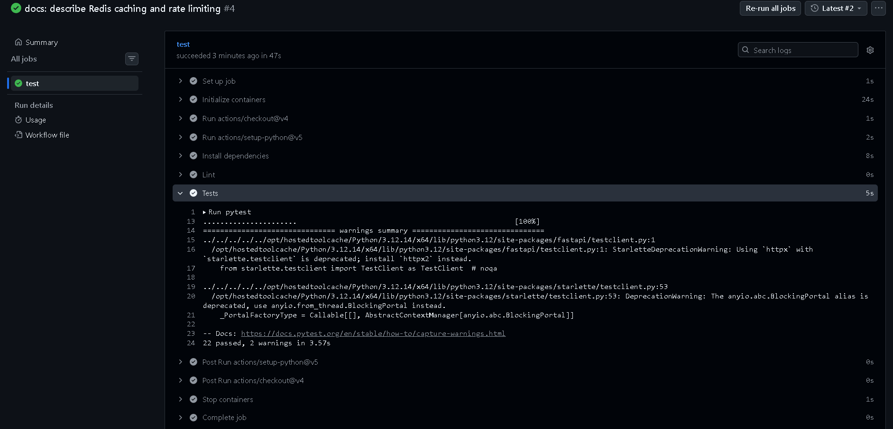
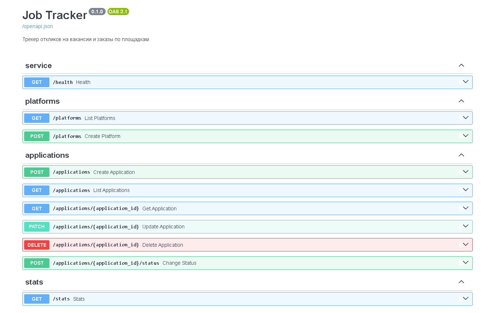
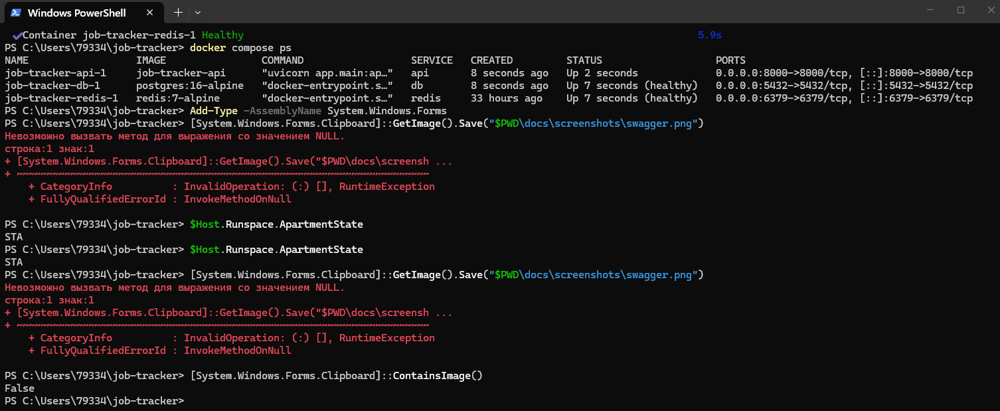

# Job Tracker

Небольшой сервис, чтобы держать под контролем отклики на вакансии и заказы:
куда отправил, когда, что ответили и какая площадка реально даёт результат.

Стек: FastAPI, PostgreSQL, SQLAlchemy 2.0, Docker Compose, pytest, GitHub Actions.

## Схема данных

Три таблицы:

| Таблица | Что хранит |
|---|---|
| `platforms` | площадки: hh.ru, Профи.ру, Хабр Карьера, прямой контакт |
| `applications` | сам отклик: компания, позиция, ссылка, вилка, дата, текущий статус |
| `events` | история статусов по отклику — когда и на что сменился |

Текущий статус лежит прямо в `applications` (быстрые фильтры), а `events`
хранит всю историю. Статусы: `sent`, `viewed`, `invited`, `interview`,
`offer`, `rejected`, `no_response`.

## Запуск

```bash
cp .env.example .env
docker compose up --build
```

Документация API: http://localhost:8000/docs

## Запуск без Docker

```bash
docker compose up -d db          # нужна только база
python -m venv .venv && source .venv/bin/activate
pip install -r requirements-dev.txt
uvicorn app.main:app --reload
```

## Тесты

```bash
docker compose up -d db
pytest
```

Тесты идут в отдельную базу `tracker_test` — её создаёт
`scripts/init-test-db.sql` при первом старте контейнера с Postgres.
Каждый тест поднимает и сносит схему заново, так что рабочие данные не трогаются.

## Эндпоинты

| Метод | Путь | Что делает |
|---|---|---|
| `GET` | `/health` | проверка живости |
| `POST` | `/platforms` | добавить площадку |
| `GET` | `/platforms` | список площадок |
| `POST` | `/applications` | зарегистрировать отклик |
| `GET` | `/applications` | список с фильтрами `status`, `platform_id`, пагинацией |
| `GET` | `/applications/{id}` | отклик с историей событий |
| `PATCH` | `/applications/{id}` | поправить поля |
| `POST` | `/applications/{id}/status` | сменить статус и записать событие |
| `DELETE` | `/applications/{id}` | удалить отклик |
| `GET` | `/stats` | сводка по площадкам: сколько ушло, сколько ответили |

## Пример

```bash
curl -X POST localhost:8000/platforms \
  -H 'Content-Type: application/json' \
  -d '{"name": "hh.ru", "url": "https://hh.ru"}'

curl -X POST localhost:8000/applications \
  -H 'Content-Type: application/json' \
  -d '{"platform_id": 1, "company": "Ozon", "position": "Python-разработчик"}'

curl -X POST localhost:8000/applications/1/status \
  -H 'Content-Type: application/json' \
  -d '{"status": "invited", "comment": "Позвали на скрининг"}'

curl localhost:8000/stats
```

## Как это выглядит

### CI и тесты


### API


### Запуск

